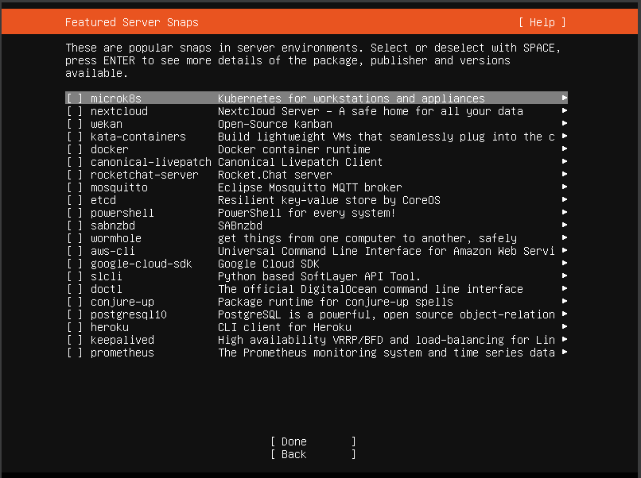

# **How to Set Up a VM Server on Windows with SSH and VS Code**

This guide walks you through setting up a virtual machine (VM) on Windows, configuring SSH access, and connecting to it using VS Code. By the end, you'll have a functional VM server that's ready for development.

## **Prerequisites**

Before starting, ensure you have the following:

- A Windows machine with virtualization enabled.
- A hypervisor installed, such as:
  - [**VirtualBox**](https://www.virtualbox.org/wiki/Downloads) (used in this guide).
  - [**Hyper-V**](https://learn.microsoft.com/en-us/virtualization/hyper-v-on-windows/) (optional alternative for Windows Pro/Enterprise users).
- **Windows Subsystem for Linux (WSL)** installed (required only if using VirtualBox alongside WSL).
- [**VS Code**](https://code.visualstudio.com/) installed on your Windows machine.

---

## **Step 1: Install VirtualBox (or Hyper-V)**

### **Option 1: Install VirtualBox**

1. Download the VirtualBox installer from the [official VirtualBox website](https://www.virtualbox.org/wiki/Downloads).
2. Run the installer and follow the on-screen instructions to complete the installation.

---

## **Step 2: Create and Set Up the VM**

1. **Download a Linux distribution ISO** (e.g., Ubuntu Server) for your VM.  
   - [Download Ubuntu Server here.](https://ubuntu.com/download/server)  
   - Example of the VirtualBox home screen:  
     

2. Open **VirtualBox**, click **New**, and follow the prompts to create your VM.  
   

3. **Set the VM name** to something memorable (e.g., `UbuntuDev`) and select the downloaded ISO.

4. When prompted, **create a password** that’s easy to remember.  
   - Note: Since we’ll use RSA keys later, the password will have limited significance.  
     

5. **Allocate resources**:  
   - 2 CPUs and 4096 MB (4 GB) of RAM is ideal for general use.  
     

6. **Create a virtual hard disk**:  
   - Set it to 200 GB for sufficient space.  
     

7. Review the summary before proceeding.  
   

---

## **Step 3: Set Up the Machine**

1. Click **Finish** and boot the machine. You should see the following screen:  
   

2. Press **Enter** to continue.

3. Decline the update prompt and proceed without updating.  
   

4. Follow the on-screen prompts by pressing **Enter** at each step:  
   - Keyboard layout:  
       
   - Server type:  
       
   - Network connections:  
       
   - Configure proxy:  
       
   - Ubuntu archive mirror:  
       
   - Guided storage configuration:  
     

5. **Storage setup**: Press **Done** and **Continue** on the storage configuration screen.  
   

6. Set up the server profile:  
   - For example, use `test` as the server name and `1-8` as the password.  
     

7. Skip upgrading to Ubuntu Pro.  
   

8. Ensure **Install OpenSSH Server** is selected before continuing.  
   

9. Skip additional featured server snaps and wait for the system to install.  
     
   

10. Once installation is complete, **shut down the VM**.

## **Step 4: Set Up OpenSSH**

1. Configure **Port Forwarding** to enable SSH access from the host machine to the VM:
   - Go to the VM's **Settings** in VirtualBox.
   - Navigate to **Network** > **Advanced** > **Port Forwarding**.
   - Add a new rule with the following details:
  
     ``` text
     Name: SSH
     Protocol: TCP
     Host IP: 127.0.0.1
     Host Port: 2222
     Guest IP: (leave empty or use 10.0.2.15)
     Guest Port: 22
     ```

   - Click **OK** to save the rule.  
   

2. Boot the VM. You can run it normally or in **Headless Mode** for efficiency.

3. Open **Command Prompt (cmd)** or a terminal on the host machine.

4. Use SSH to log in to the VM with the following command:

   ```bash
   ssh -p 2222 username@127.0.0.1
   ```

   Replace `username` with the username you created during the VM setup.  
   

5. If prompted, accept the SSH key fingerprint by typing `yes`.

6. Once logged in, you have successfully connected to the VM using OpenSSH.
Here’s an improved version of **Step 5**:

---

## **Step 5: (Optional) Set Up Automatic SSH Login with RSA**

1. Locate your **`id_rsa.pub`** file (usually found in `C:/Users/YourUsername/.ssh` on Windows).  
   - If it doesn’t exist, generate a new RSA key pair with the following command:  

     ```bash
     ssh-keygen -t rsa
     ```

2. Copy the contents of **`id_rsa.pub`** to your clipboard.  
   - On Windows, you can use:  

     ```bash
     clip < ~/.ssh/id_rsa.pub
     ```

3. Log in to your Ubuntu server (using your password).  

4. Open or create the **`authorized_keys`** file in your server's `.ssh` directory:  

    ```bash
    nano ~/.ssh/authorized_keys
    ```

5. Paste the contents of your **`id_rsa.pub`** into the file.

6. Save and exit the editor (`Ctrl+O`, `Enter`, then `Ctrl+X` in Nano).

7. Verify that the key works:
   - Exit the server with:  

     ```bash
     exit
     ```  

   - Reconnect using SSH:  

     ```bash
     ssh -i ~/.ssh/id_rsa <username>@<server-ip> -p <port>
     ```  

8. If you’re not prompted for a password, the RSA key setup was successful!
   - If it still requests a password, recheck the **permissions** of your `.ssh` directory and `authorized_keys` file:  

     ```bash
     chmod 700 ~/.ssh
     chmod 600 ~/.ssh/authorized_keys
     ```
